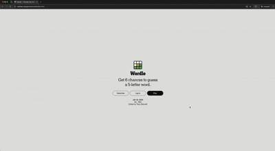

# WordleGrade

WordleGrade is a project that uses expected information gain to grade a game of Wordle. This project was inspired by the 3Blue1Brown video series however this project is far simpler e.g. WordleGrade assumes that the distribution of the wordle words as the answer is uniform.

## Grading

As mentioned before `WordleGrade` uses average of the expected information gain from the guesses to grade a game this means that it is feasible that a game of length 6 gives a better grade than one where the player guesses the word on the second attempt. This might seem wrong to some, but it's seems reasonable if you accept what `WordleGrade` actually does is not game specific but rather more general. It is also possible to change the grading metric to `Actual Information Gain`.

Another thing to know is that the first guess of a game isn't considered in the grading. The goal of this detail is to make the game less "robotic", at the start of the game the player has 0 information and therefore no real oppurtunity to make a "good" guess therefore it's ignored.

## How to run

### Server

There is no intention to run a remote server therefore to use the grader one will have to run the server locally. Here are the steps for starting the server.

1. Create and activate a virutal environement, either venv or conda.
2. Download the required dependencies with `pip install -r requirements.txt`
3. Start the server with `fastapi dev`.

### Web Page

To run the custom Wordle page with custom answer do the following :

1. cd to the client directory
2. Run the command `node run dev`
3. Go to `localhost:3000`

### Extension

The instructions for running the extension locally is slightly different depending on your choice of browser. However regardless of the browser, you have to start the server locally as well.

#### Firefox

To run the extension in firefox, follow these steps:

1. Go to `about:debugging`
2. Select `this firefox`
3. Press `load temporary addon`, and upload the manifest file `manifest.json` in the extension directory.

#### Chrome

On Google Chrome and other chromium based browsers, follow these steps:

1. Go to `chrome://extensions`
2. Enable developer mode in the top right.
3. Press `load unpacked` and upload the directory `extension`.

## Future

### Extension Changes

In the future the extension might be refactored to run solely on the browser. This would be benefitial as it would eliminate many nuances, e.g. CORS, or other browser security policies. Additionally it would increase trust in the product and probably encourage more people to try it out.
